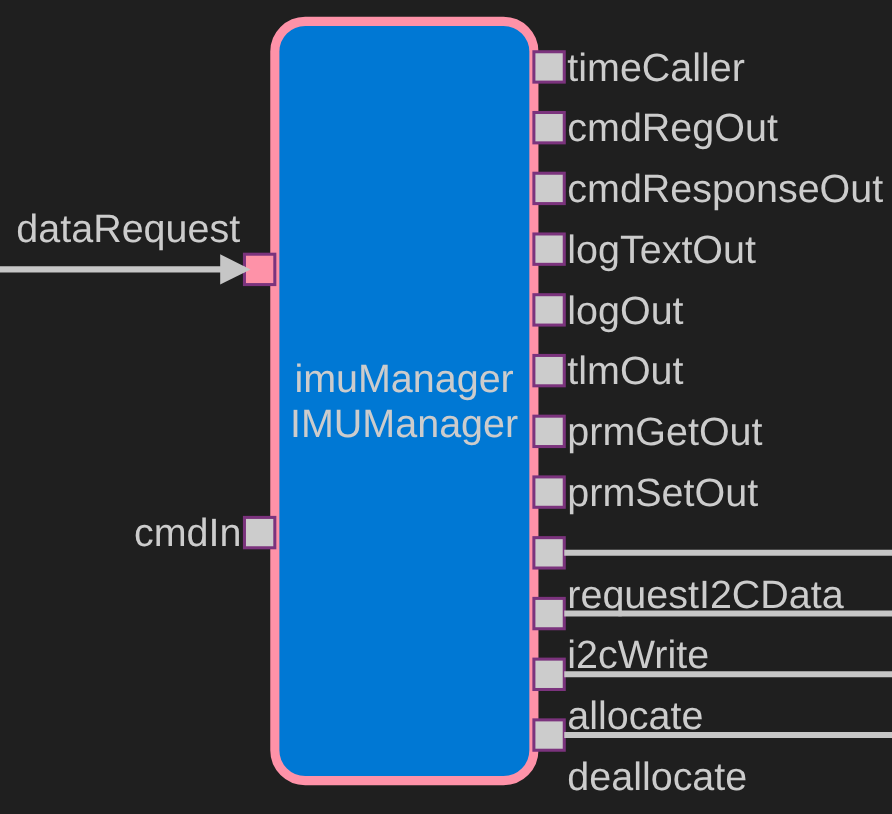

# IMUManager Software Design Document

## 1. Overview

`IMUManager` interfaces with a Bosch BNO055 IMU (I2C address `0x28`) to periodically collect inertial measurement data. On each rate-group tick it issues a combined I2C write-read to retrieve all 43 sensor bytes from register `0x08`, then publishes 21 telemetry channels covering accelerometer, magnetometer, gyroscope, Euler angles, quaternion, linear acceleration, gravity, and temperature. The component self-configures the BNO055 into NDOF (9-DOF fusion) mode on first call if not yet initialized; it stops collecting data after `MAX_RESETS` failed configuration attempts.

## 2. Usage

1. Connect a rate group member → `imuManager.schedIn` (e.g. `rateGroup1.RateGroupMemberOut[N]`).
2. Call `imuManager.startup()` from the deployment initialization sequence before the rate group fires.
3. Wire `i2cWrite` and `i2cWriteRead` to the I2C driver.



## 3. Ports

### Input ports

| Port | Type | Sync | Description |
|---|---|---|---|
| `schedIn` | `Svc.Sched` | guarded | Rate-group tick: reads all sensor data and publishes telemetry. Runs configuration on first call if not initialized. |

### Output ports

| Port | Type | Description |
|---|---|---|
| `i2cWrite` | `Drv.I2c` | Writes a configuration register byte. |
| `i2cWriteRead` | `Drv.I2cWriteRead` | Combined write+read used to address and retrieve the 43-byte data block. |
| `allocate` | `Fw.BufferGet` | Acquires buffers from the buffer manager. |
| `deallocate` | `Fw.BufferSend` | Returns buffers to the buffer manager. |

## 4. Commands

None.

## 5. Events

| Mnemonic | Severity | Parameters | Condition |
|---|---|---|---|
| `i2cSuccess` | ACTIVITY_HI | — | I2C transaction returned OK. |
| `i2cAddressFailure` | WARNING_HI | — | I2C returned address error. |
| `i2cWriteError` | WARNING_HI | — | I2C returned write error. |
| `i2cReadError` | WARNING_HI | — | I2C returned read error. |
| `i2cOpenError` | WARNING_HI | — | I2C device failed to open. |
| `i2cOtherError` | WARNING_HI | — | I2C returned unrecognized error. |
| `MemoryAllocationFailed` | WARNING_LO | — | Buffer allocation returned invalid or undersized buffer. |
| `configEvent` | WARNING_LO | `msg: string` | Informational configuration status message. |
| `configError` | WARNING_HI | `msg: string` | Configuration step failed. |
| `deviceError` | WARNING_HI | `error: U16` | BNO055 SYS_ERR register returned non-zero. |

## 6. Telemetry

| Channel | Type | Update Rate | Description |
|---|---|---|---|
| `acc_x` | `F32` | Per `schedIn` tick | Accelerometer X (m/s², divided by 100) |
| `acc_y` | `F32` | Per tick | Accelerometer Y |
| `acc_z` | `F32` | Per tick | Accelerometer Z |
| `mag_x` | `F32` | Per tick | Magnetometer X (µT, divided by 16) |
| `mag_y` | `F32` | Per tick | Magnetometer Y |
| `mag_z` | `F32` | Per tick | Magnetometer Z |
| `gyr_x` | `F32` | Per tick | Gyroscope X (dps, divided by 16) |
| `gyr_y` | `F32` | Per tick | Gyroscope Y |
| `gyr_z` | `F32` | Per tick | Gyroscope Z |
| `eul_x` | `F32` | Per tick | Euler heading (°, divided by 16) |
| `eul_y` | `F32` | Per tick | Euler roll |
| `eul_z` | `F32` | Per tick | Euler pitch |
| `qua_x` | `F32` | Per tick | Quaternion X (divided by 16384) |
| `qua_y` | `F32` | Per tick | Quaternion Y |
| `qua_z` | `F32` | Per tick | Quaternion Z |
| `lia_x` | `F32` | Per tick | Linear acceleration X (m/s², divided by 100) |
| `lia_y` | `F32` | Per tick | Linear acceleration Y |
| `lia_z` | `F32` | Per tick | Linear acceleration Z |
| `grv_x` | `F32` | Per tick | Gravity vector X (m/s², divided by 100) |
| `grv_y` | `F32` | Per tick | Gravity vector Y |
| `grv_z` | `F32` | Per tick | Gravity vector Z |
| `temp` | `I8` | Per tick | On-chip temperature (°C) |

## 7. State machine

Not a formal FSM. Initialization is guarded by a boolean:

```
boot → schedIn_handler called
  └─ !initialized → config() [runs NDOF config sequence]
      └─ success → initialized = true
      └─ fail, resets++ → if resets >= MAX_RESETS: stop collecting data
  └─ initialized → read 43 bytes, publish telemetry
```

## 8. Design decisions

- **Hardware-direct only:** `VIRTUAL_IMU` preprocessor guards have been removed. The component always uses the real I2C hardware path. Simulation uses the `DummyI2cDriver`.
- **Self-configuration on first tick:** `startup()` is called from deployment init, but `schedIn_handler` also re-runs `config()` if `initialized` is false, making recovery from a failed init automatic.
- **Buffer validity guard:** `isValid()` is checked before calling `deallocate_out` on a failed allocation (prevents deallocating an invalid buffer).
- **43-byte bulk read:** All sensor axes are retrieved in one `i2cWriteRead` call to minimize I2C transactions per tick.
- **Telemetry gated behind I2C_OK:** `schedIn_handler` and `readConfigReg` capture the `Drv::I2cStatus` return value and only call `deserializeAndPublish` (or deserialize the config byte) when `status == I2C_OK`. Failed reads return early after logging and deallocating buffers — stale bytes never reach telemetry channels.
- **`deserializeAndPublish` helper:** extraction of the 21-channel deserialization loop out of `schedIn_handler` to keep both functions within the 60-line limit.

## 9. Unit test plan

- [ ] Normal operation: initialized=true, successful I2C read → 21 telemetry channels updated.
- [ ] Uninitialized on first tick: `config()` called, no data read.
- [ ] Config failure: `resets >= MAX_RESETS` → `schedIn_handler` returns immediately.
- [ ] Write buffer allocation failure: `allocate_out` returns invalid → `MemoryAllocationFailed` emitted, no crash.
- [ ] Read buffer allocation failure: same for read buffer.
- [ ] I2C error on data read: named warning event emitted.
- [ ] Correct conversion: raw 2-byte signed value correctly divided by conversion rate.
